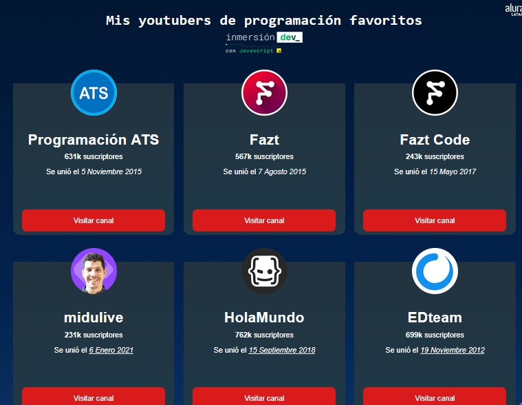
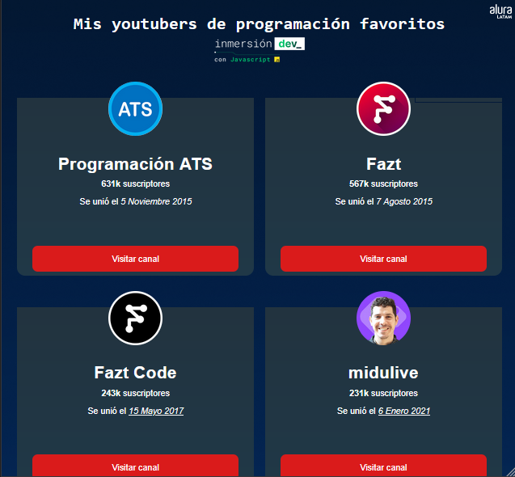
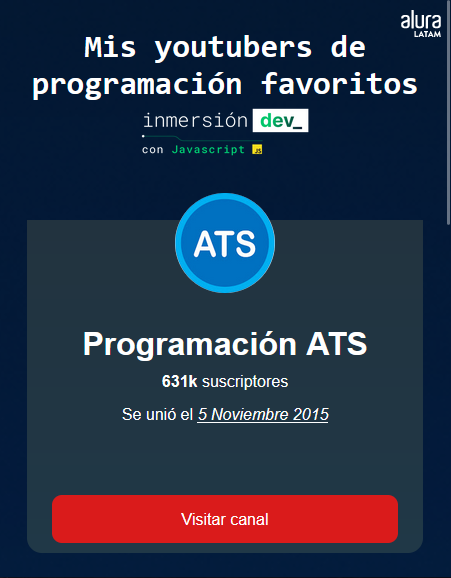

# Proyecto de Catálogo de YouTubers de Programación

Este proyecto fue desarrollado como parte del curso de JavaScript de Alura LATAM.

## Descripción del Proyecto

Este proyecto consiste en un catálogo de mis YouTubers de programación favoritos, creado como parte de la Inmersión Dev de Alura Latam. Durante la clase de manipulación básica del DOM con JavaScript, se nos pidió crear un catálogo del tema que quisiéramos.

Como desafío adicional, decidí adaptar el proyecto para mostrar información sobre mis YouTubers favoritos que se dedican a la programación. También estelicé los contenedores de los youtubers, agregando un estilo de cartas para que tuviera un mejor atractivo visual

## Funcionalidades

- Visualización de información sobre varios YouTubers de programación.
- Diseño adaptable a diferentes dispositivos utilizando CSS Grid.
- Estilo personalizado con tarjetas para cada YouTuber.
- Utilización de JavaScript para agregar a los Youtubers al DOM

## Demo
Puedes visualizar una `Demo` de la página [aquí](https://juanblancodev.github.io/yt-channles-catalog/)

## Capturas de Pantalla
Aquí 3 capturas de pantalla sobre como se ve el proyecto adaptado a diferentes dispositivos

## Autor

[Juan Blanco dev](https://github.com/JuanBlancodev)